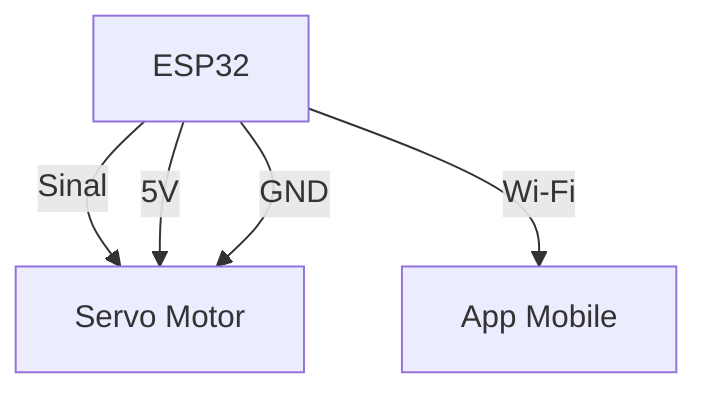
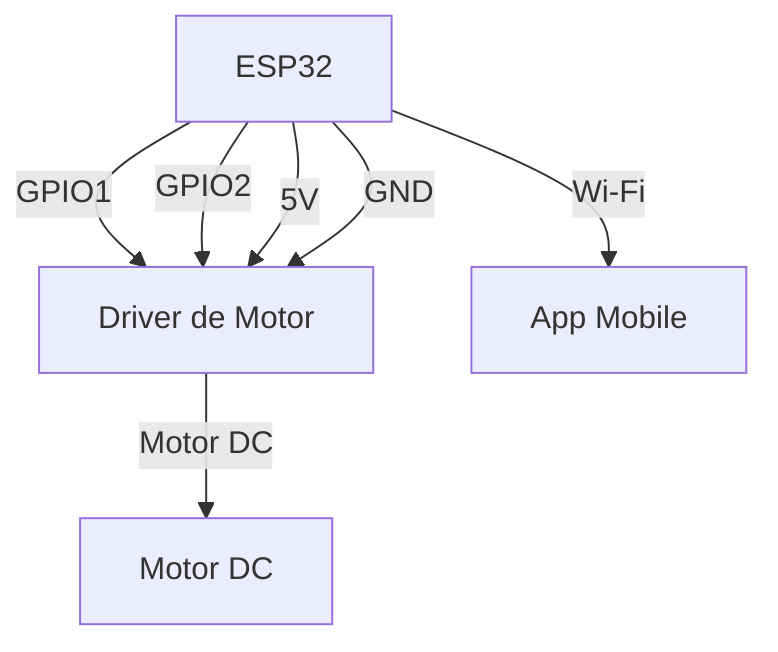

# Guarda-Chuva IoT com ESP32

Este projeto permite controlar um guarda-chuva automatizado via ESP32, utilizando um aplicativo mobile. O ESP32 recebe comandos HTTP para abrir, fechar e consultar o status do guarda-chuva, além de fornecer previsão do tempo.

## Materiais necessários
- 1x ESP32 DevKit
- 1x Motor (servo ou DC, conforme o projeto do guarda-chuva)
- 1x Driver de motor (caso use motor DC)
- Jumpers
- Fonte de alimentação adequada
- Guarda-chuva adaptado
- (Opcional) Sensores de chuva ou temperatura

## Esquemático de Conexão

### Exemplo com Servo Motor
- Fio de sinal do servo → GPIO do ESP32 (ex: D5)
- VCC do servo → 5V do ESP32 (ou fonte externa)
- GND do servo → GND do ESP32

#### Diagrama:

### Exemplo com Motor DC
- Motor DC → Driver de motor (IN1/IN2)
- Driver de motor → GPIOs do ESP32 (ex: D5 e D18)
- VCC do driver → 5V do ESP32 (ou fonte externa)
- GND do driver → GND do ESP32

#### Diagrama:

## Configuração do ESP32

1. Programe o ESP32 com um firmware que:
   - Crie um servidor HTTP.
   - Responda aos endpoints `/abrir`, `/fechar`, `/status` e `/previsao`.
   - Controle o motor conforme o endpoint acessado.
2. Conecte o ESP32 à mesma rede Wi-Fi do seu celular.
3. Descubra o IP do ESP32 (pode ser exibido no monitor serial).

## Configuração do App

1. Abra o app.
2. No onboarding, insira o IP do ESP32.
3. Use os botões para abrir/fechar o guarda-chuva e consultar o status.

---

> **Observação:** Não há integração direta com Arduino neste projeto, apenas com ESP32. 

